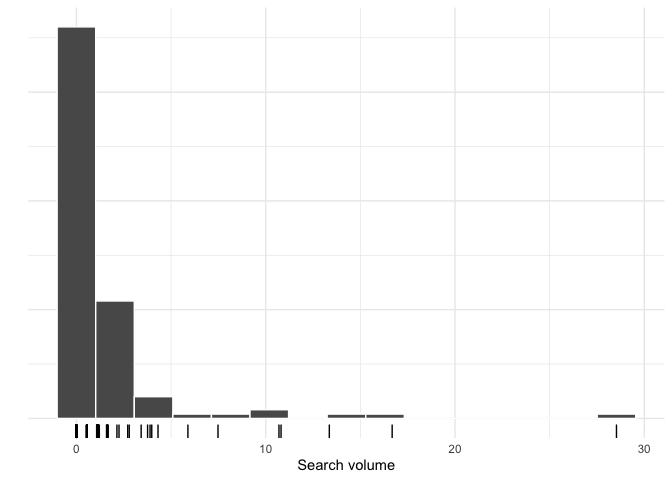
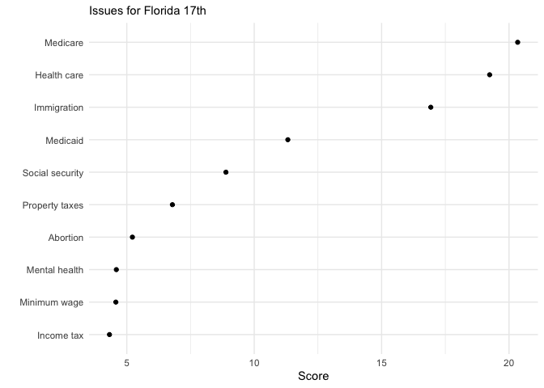
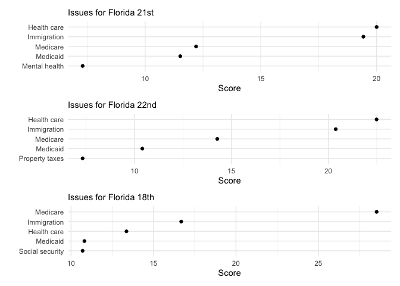

## Using Google Search Trends for Political Research

Using 2018 mid-term search trends data provide by Google at [Google
Trends datasets](https://googletrends.github.io/data/) page on Github.

### Get data

``` r
base_url <- 'https://raw.githubusercontent.com/googletrends/data/master/'
file_url <- 'Search_Data_US_Congressional_District_04Nov2018.csv'

df <- paste0(base_url, file_url) %>% 
  vroom::vroom()
```

### Explore Distribution of Search Scores

Use Florida’s 18th as example.

``` r
# distribution of trend scores
df %>% 
  filter(District == 'Florida 18th') %>% 
  select(-(FIRST:TENTH),-District,-Code, -State) %>% 
  gather() %>% 
  ggplot(aes(value)) +
  geom_histogram(bins = 15, col='white') +
  geom_rug() +
  labs(x = 'Search volume',
       y = '') +
  theme(axis.text.y = element_blank())
```

<!-- -->

DRY function to grab and plot top `n` issues and their search volume for
a district.

``` r
get_top_n <- function(df, district,n=20){
  df %>% 
    filter(District == district) %>% 
    select(-(FIRST:TENTH),-District,-Code, -State) %>% 
    gather() %>% 
    arrange(-value) %>% 
    head(n) %>% 
    ggplot(aes(reorder(key,value), value)) +
    geom_point() +
    coord_flip() +
    labs(x = '', y = 'Score', 
         subtitle = paste('Issues for', district)) 
}
```

### Top `n` example

``` r
get_top_n(df, 'Florida 17th', 10)
```

<!-- -->

### Top 5 issues for Florida

Get top 5 issues for each congressional district in Florida and
aggregate them.

``` r
nested_df <- df %>% 
  select(-(FIRST:TENTH), -Code) %>% 
  gather(key,val, -District, -State) %>% 
  group_by(District) %>% 
  nest()
  
top_5_scores <- nested_df %>%
  mutate(top_n = map(data, ~ arrange(.x, desc(val)) %>% head(.,5))) %>%
  unnest(top_n) %>% 
  filter(State == 'FL') %>% 
  group_by(key) %>% 
  summarise(top_mentions = n(), median_score=median(val)) %>% 
  arrange(desc(top_mentions)) 


top_5_scores %>% 
  head(5) %>% 
  pander::pander()
```

|       key       | top\_mentions | median\_score |
| :-------------: | :-----------: | :-----------: |
|   Health care   |      27       |     16.67     |
|   Immigration   |      27       |     14.66     |
|    Medicaid     |      27       |     10.4      |
|    Medicare     |      26       |     12.05     |
| Social security |      10       |     7.015     |

### Palm Beach County

Top 5 issues around Palm Beach County

``` r
p1 <- get_top_n(df,'Florida 21st', 5)
p2 <- get_top_n(df,'Florida 22nd', 5)
p3 <- get_top_n(df,'Florida 18th', 5)

p1 + p2 + p3 + plot_layout(ncol = 1)
```

<!-- -->
